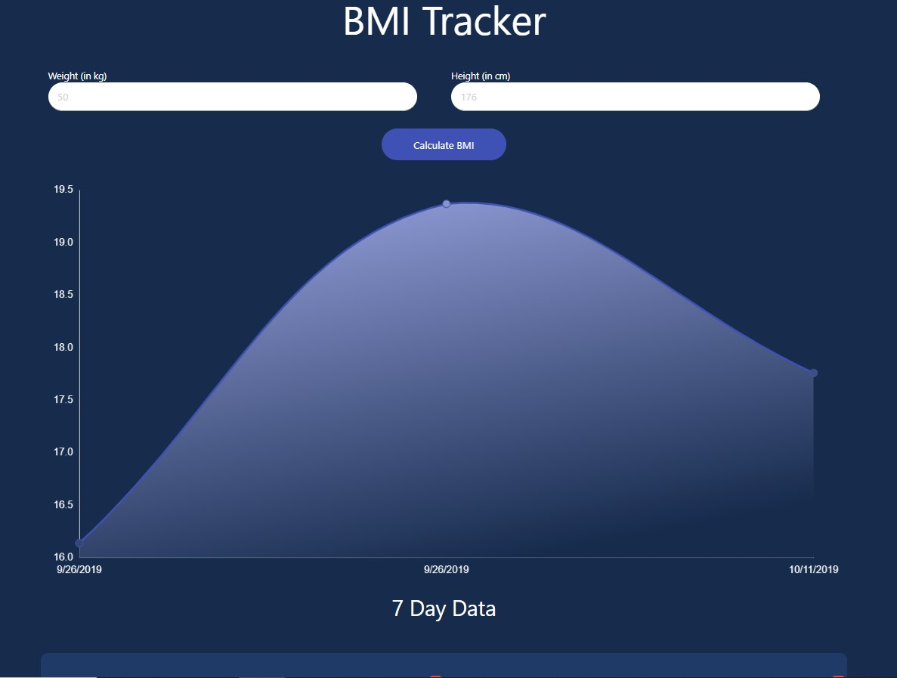
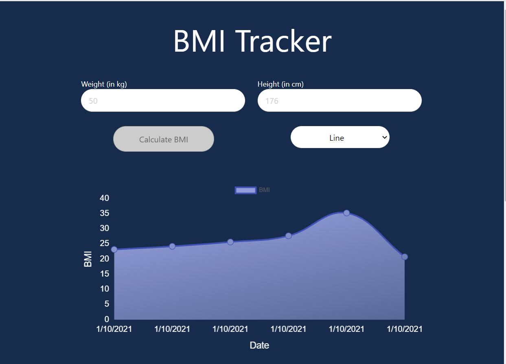
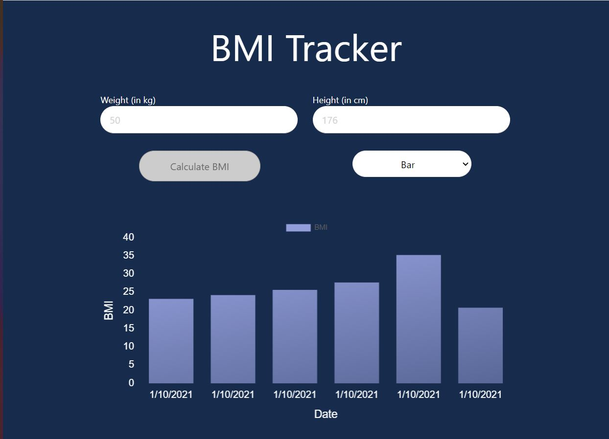
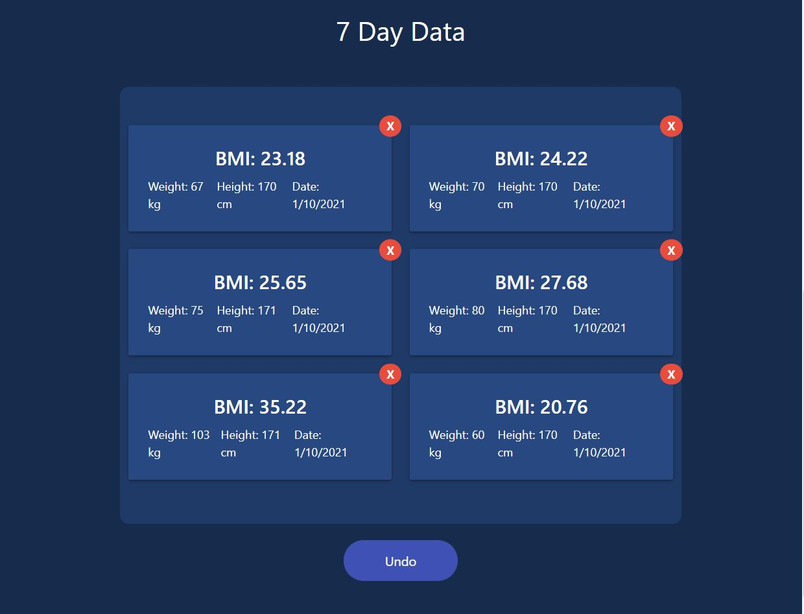

## BMI Calculator

React Hooks app to calculate the BMI of a person. It can store the data for 7 days with the help of LocalStorage.

<!--  -->
Line Chart

Bar Chart

7 Days Data

Created with _create-react-app_. See the [full create-react-app guide](https://github.com/facebook/create-react-app/blob/master/packages/cra-template/template/README.md).

## Install

`npm install`

## Usage

`npm start`
